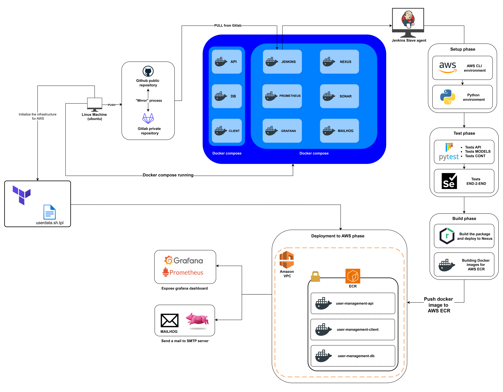

# User Management Application - AWS Deployment Pipeline

This project deploys a user management application to AWS using Terraform and Jenkins.

## Project Structure

```
├── cloud_infrastructure/
│   ├── main.tf
│   ├── variables.tf
│   ├── outputs.tf
│   └── templates/
│       └── userdata.sh.tpl
├── user_management_app/
│   ├── api/
│   ├── client/
│   ├── tests/
│   └── robot_tests/
└── internal_apps_monitoring/
```

<center>
</img>
</center>

## Prerequisites

- Jenkins with `python_slave_agent`
- Terraform ≥ 1.5.0
- AWS CLI configured
- Python 3.9+
- Git

## AWS Configuration

```bash
aws configure set aws_access_key_id YOUR_ACCESS_KEY
aws configure set aws_secret_access_key YOUR_SECRET_KEY
aws configure set region us-east-1
```

## SSH Key Setup

```bash
ssh-keygen -t rsa -b 4096 -f ~/.ssh/id_rsa -N ''
```

## Jenkins Environment Variables

```bash
VENV_PATH = "${WORKSPACE}/venv"
APP_DIR = "${WORKSPACE}/user_management_app"
TF_WORKING_DIR = "${WORKSPACE}/cloud_infrastructure"
EMAIL_RECIPIENTS = 'your-email@example.com'
NEXUS_URL = 'http://nexus.host.internal'
NEXUS_REPOSITORY = 'user_management_app'
NEXUS_CREDENTIALS_ID = 'JENKINS_TOKEN'
PROMETHEUS_PUSH_GATEWAY = 'http://prometheus.host.internal'
```

## Pipeline Stages

1. **Setup Python Environment** – Creates virtual environment  
2. **Tool Verification** – Checks AWS CLI, Terraform, Git  
3. **AWS Cleanup** – Removes old resources  
4. **Terraform Configuration** – Validates and fixes config  
5. **Dependency Installation** – Installs Python requirements  
6. **Service Startup** – Launches Flask API  
7. **Test Execution** – Runs unit and Robot tests  
8. **Prometheus Metrics** – Sends build metrics  
9. **Python Package Build** – Creates wheel and tar.gz  
10. **Nexus Deployment** – Uploads artifacts  
11. **AWS Deployment** – Deploys infrastructure and application

## Terraform Resources

- VPC (existing)
- Public subnet in `us-east-1a`
- Security Group (ports `22`, `80`, `5000`, `8083`)
- EC2 `t3.micro` instance
- Elastic IP
- Internet Gateway
- Route Table

## Manual Deployment

```bash
cd cloud_infrastructure
terraform init
terraform validate
terraform plan -out=tfplan
terraform apply -auto-approve tfplan
```

## Access Instance

```bash
ssh -i ~/.ssh/id_rsa ubuntu@$(terraform output -raw instance_public_ip)
```

## Verification

```bash
systemctl status user-management-api.service
systemctl status user-management-client.service
curl http://localhost:5000/health
curl http://localhost:8083/health
```

## Troubleshooting

**Common issues**

- SSH host key changes
- Missing systemd services
- `pip3` not installed
- Closed ports

**Check logs**

```bash
tail -f /var/log/cloud-init-output.log
journalctl -u user-management-api.service -f
```

## Monitoring

**Health checks**

```bash
curl http://IP_ADDRESS:5000/health
curl http://IP_ADDRESS:8083/health
```

Build metrics are pushed to Prometheus (via the configured Pushgateway).

## Notifications

Email notifications include:

- Build status
- Execution duration
- Deployment URLs
- Package version

## Maintenance

**Update application**

1. Modify code in `user_management_app/`
2. Jenkins pipeline detects changes
3. Automatic AWS deployment

**Destroy infrastructure**

```bash
cd cloud_infrastructure
terraform destroy -auto-approve
```

## Support

Check for issues in:

1. Jenkins detailed logs
2. EC2 cloud-init logs
3. AWS IAM configuration
4. Security Group rules

Build metrics are available in Prometheus for performance analysis.